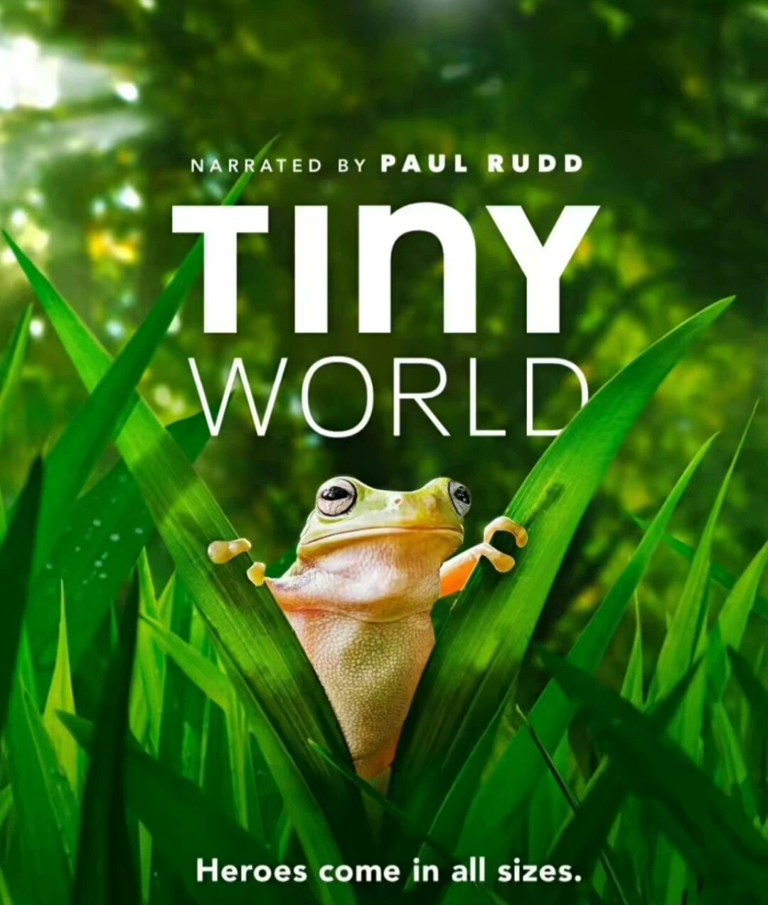
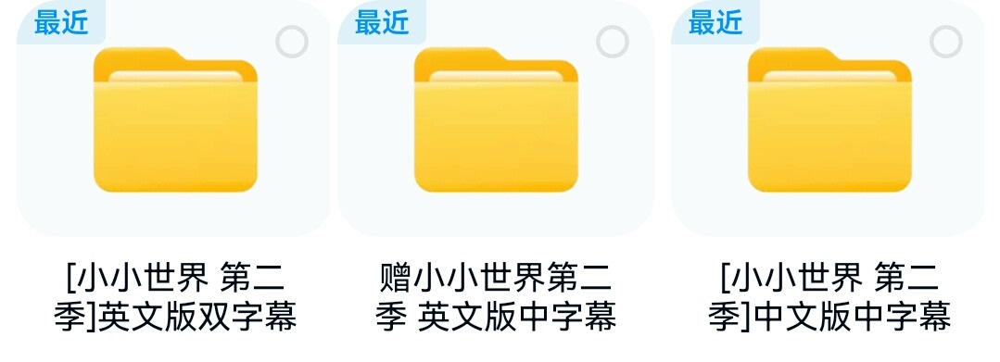
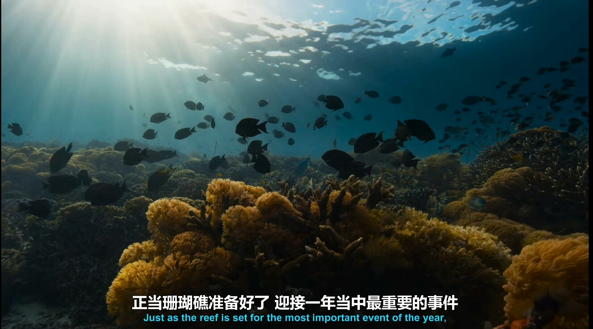
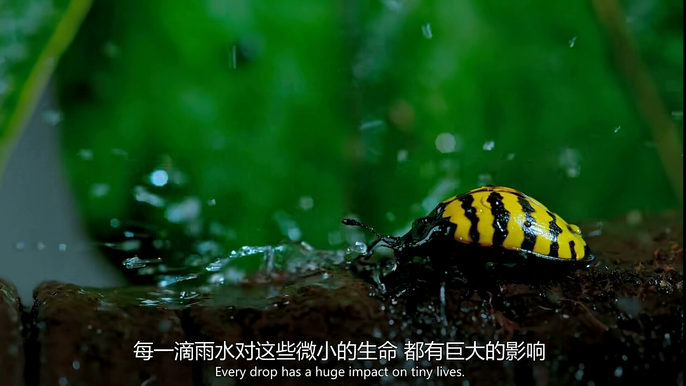
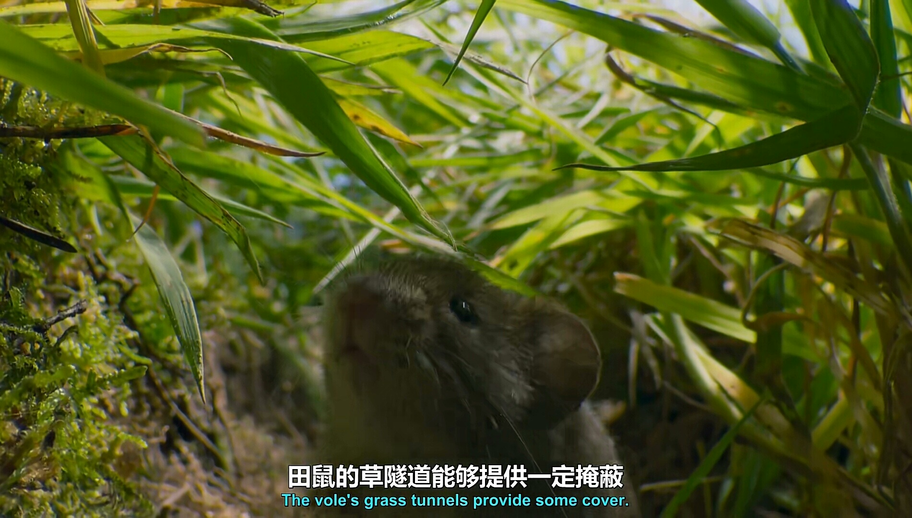
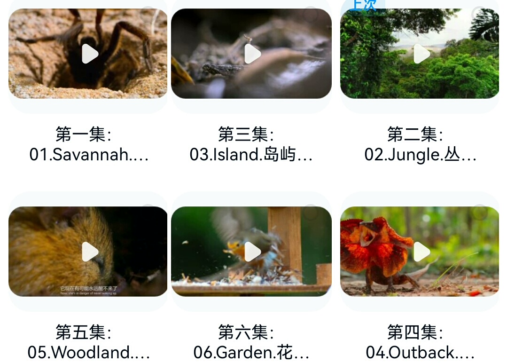

# 【35】CCTV's "Tiny World" documentary series, promoted by the Central Television Station.

## Body

[CCTV] The "Tiny World" documentary, acclaimed by CCTV, is a must-watch for children!
? Auto-shipping available.

[Fire] 12 episodes (each episode lasts 30 minutes, totaling 2 seasons)

? Chinese version with subtitles for both seasons in 4K quality
? English version with bilingual subtitles for both seasons in 4K quality

Order now and get it instantly! All included for just one yuan.
Special offer! Just place an order and you're done!

[Green Circle] A high-rated documentary that introduces the microcosm to children, each episode lasting about 30 minutes, is perfect for children to watch.
[Yellow Circle] From editing, music, color, and narrative style, everything is exceptionally well done. Every shot is a comforting image, reminding me of watching Animal World as a child. This documentary truly delivers stunning visual effects.
It's an interesting children's natural enlightenment documentary that directly satisfies their curiosity.
[Red Circle] The "Tiny World" production team spent 3611 days, nearly ten years, and over 3160 hours of footage to condense into 6 episodes, introducing more than 400 species, which is extremely comfortable.

[Fire] Place your order directly, and receive both Baidu Cloud and Kuaike Cloud links. After the virtual item is shipped, there will be no returns or exchanges. Thank you.

## Images

## Payment

Here is a pay link on Stripe ( https://buy.stripe.com/3cs8yP7sY87d0vu9AB ). Please contact me lonlonago@foxmail.com after funding $89, and I will send you a complete data files , thank you!

